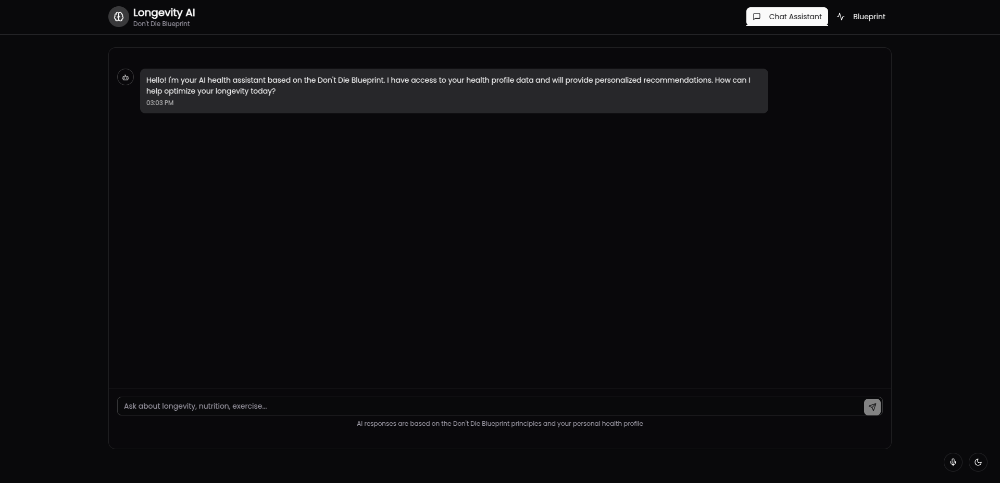

# DD-Agent: AI-Powered Health Optimization Platform

DD-Agent is an AI-powered health optimization platform based on Bryan Johnson's 'Don't Die Blueprint.' It provides personalized health recommendations and longevity insights through an interactive chat interface and a structured blueprint generator.



## 🌟 Features

- **Interactive Chat Interface**: Talk directly with an AI health assistant that provides personalized recommendations based on your health data
- **Personalized Blueprint Generator**: Create a comprehensive health blueprint with tailored recommendations for:
  - Sleep optimization
  - Exercise protocols
  - Nutrition plans
  - Personal health recommendations
- **User-Friendly Forms**: Easy-to-use forms for inputting your health data, including:
  - Personal information (age, weight, height, etc.)
  - Lifestyle habits (sleep, stress, exercise, etc.)
  - Health goals and preferences
- **Markdown Support**: All AI responses are formatted in Markdown for improved readability
- **Responsive Design**: Works seamlessly on desktop and mobile devices
- **Dark/Light Mode**: Toggle between dark and light themes for comfortable viewing

## 🚀 Getting Started

### Prerequisites

- [Node.js](https://nodejs.org/) (v18 or higher)
- [Bun](https://bun.sh/) (v1.0 or higher)
- OpenAI API key for AI functionality

### Installation

1. Clone the repository:
   ```bash
   git clone https://github.com/yourusername/dd-agent.git
   cd dd-agent
   ```

2. Install dependencies:
   ```bash
   bun install
   ```

3. Create a `.env` file in the root directory with your OpenAI API key:
   ```
   OPENAI_API_KEY=your_openai_api_key_here
   ```

4. Start the development server:
   ```bash
   bun run dev
   ```

5. Open [http://localhost:3000](http://localhost:3000) in your browser to see the application.

### Building for Production

To create a production build:

```bash
bun run build
```

To start the production server:

```bash
bun run start
```

## 🧩 Project Structure

```
dd-agent/
├── public/            # Static assets
├── src/
│   ├── app/           # Next.js app router pages
│   ├── components/    # React components
│   │   ├── blueprint-cards/  # Blueprint form components
│   │   └── ui/        # UI components
│   ├── lib/           # Utility libraries
│   ├── utils/         # Helper functions and types
│   └── styles/        # Global styles
├── .env               # Environment variables
└── package.json       # Project dependencies
```

## 🔍 Key Components

### Blueprint Flow

The blueprint generation process follows these steps:

1. **Personal Information**: Collect basic health metrics (age, weight, height, etc.)
2. **Lifestyle Assessment**: Gather information about sleep, stress, and activity levels
3. **Health Goals**: Identify primary health objectives and specific goals
4. **Blueprint Generation**: Process data through AI to create personalized recommendations
5. **Results Display**: Present tailored health insights in a readable format

### Chat Interface

The chat interface allows users to:

- Ask specific health questions
- Receive personalized advice based on their health profile
- Get clarification on blueprint recommendations
- Explore additional health topics not covered in the blueprint

## 🛠️ Technologies Used

- **Frontend**: React, Next.js 15, TypeScript
- **Styling**: Tailwind CSS
- **UI Components**: Custom components with Radix UI primitives
- **Animations**: Framer Motion
- **AI Integration**: OpenAI API
- **Markdown Rendering**: React Markdown with remark-gfm
- **Package Management**: Bun

## 📊 Data Storage

For demonstration purposes, user data is currently stored in the browser's localStorage. This includes:

- Personal metrics (age, weight, height, etc.)
- Lifestyle information (sleep patterns, stress levels, etc.)
- Health goals and preferences
- Generated blueprint responses

Note: This is a temporary solution for the demo. A proper database implementation would be needed for production use.

No data is sent to external servers except when communicating with the OpenAI API for generating responses.

## 🔒 Privacy Considerations

- All user health data is stored locally in the browser
- Data is only sent to OpenAI for processing and is not retained
- No user authentication or account creation is required
- Users can clear their data at any time by clearing browser storage

## 🧪 Development Guidelines

### Adding New Features

1. Create a new branch for your feature
2. Implement the feature with appropriate tests
3. Submit a pull request with a detailed description

### Code Style

- Follow the TypeScript best practices
- Use functional components with hooks
- Maintain proper component organization
- Document complex functions and components

## 📝 License

This project is licensed under the MIT License - see the LICENSE file for details.

## 🙏 Acknowledgements

- Based on Bryan Johnson's 'Don't Die Blueprint' principles
- Built with Next.js and React
- Powered by OpenAI's language models
- UI components inspired by shadcn/ui

## 📞 Contact

For questions or support, please open an issue on the GitHub repository or contact the maintainers directly.

---

Made with ❤️ by @user64bit